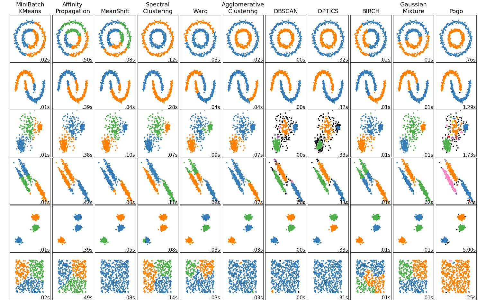

# Proportional Gap Ordering: Parameter Agnostic Topological Clustering in Metric Spaces

This is an illustration of how Pogo proceeds through a dataset. You can see the clusters merging and stabilizing
into their most persisent arrangement. The goal of Pogo is to find the best cutoff within the sequence, and assign a confidence.

## Abstract

   Filtrations of simplicial complexes, and representations like barcodes and persistence diagrams, encode topological information about a set of points, or a network graph. The 0’th dimensional persistent homology includes only points and edges, forming connected components, i.e. clusters. Here, we propose a parameter agnostic clustering algorithm, based on the statistical partitioning of filtrations into noise and features, called Proportional Gap Ordering, It transforms a filtration of simplicial complexes into a probability vector, and chooses optimal cutoffs based on the behavior of connected components, producing cluster assignments for a data set, along with a measure of likeliness for each possible clustering. In contrast to most clustering algorithms, Pogo takes only one boolean parameter, meaning that no a priori knowledge of the dataset structure is required to obtain reasonable clustering labels.

## Introduction
The bottleneck and wasserstein distances on persistence diagrams have been proven to be stable, which gives a theoretical support to using the tools of persistent homology in noisy real-world scenarios. Vectorizations like persistence landscapes and persistent entropy can be used as inputs to machine learning models, extending usefuleness even further. These representations are a powerful tool for feature detection in predictive models. Bi-filtrations multiply these capabilites by introducing a second parameter to the filtration, such as a function accounting for density, or another known property of the data. This addresses the primary weakness of persistent homology, which is unable to account for regions of density. Work from Bubenik et al has shown the fundamental ability of persistence diagrams to separate noise from topological features, due to the stable statistical properties of barcodes and filtrations. All of this taken together implies that filtrations contain inherently agnostic, yet rich statistical information about the clustering (and topological) behavior of datasets across scales and dimensions. 
  

## Background Concepts
Pogo make use of several basic mathematical concepts and constructions from various fields. The primary tool is persistent homology, a data analysis framework from topology which characterizes data by building a filtration, or nested sequence, of simplicial complexes, i.e. points and their connections.  Probability vectors are used to simplify the statistical interpretation of filtrations. The silhouette score is used as an optimization aid, because it very effectvely connects probability and clustering. Pogo combines these tools to introduce a few new transformations of filtrations that can allow for optimizing cutoffs, the 'inverted scaled gap probability vector' or 'gap vector' and the 'silhouette gap score' which are described below. An iterative process of optimization, similar to an elbow method, is used to adjust the final cutoff location.

## Procedure
Pogo begins by building a filtration of simplicial complexes from a dataset, either a point cloud, or a distance matrix, which can represent a network graph. The software package 'Gudhi' is used for this step, resulting in a data structure known as a simplex tree. The algorithm then calculates the differences between the distance value of each consecutive birth/death pair, and scales them by their position within the filtration, giving the algorithm it's name, Proportional Gap Ordering. This scaling weights the location of the cutoff towards the beginning of the filtration. The 'scaled gaps' are then transformed into a probability vector, which we call a 'gap vector' harnessing the power of statistics to give additional intelligible information about cluster likelihoods. The algorithm then merges the dataset hierarchically, based on the assignment of clusters in 0'th-dimensional persistent homology, returning a cleaner probability vector. This is accomplished by assigning any values in the 'gap vector' to the earliest occurence of each clustering, or arrangement of connected components, thus ignoring the instracluster connections that don't change the cluster assignment of any point. This is essentially a filtration of unique clusterings. Then the index of the maximum value is taken as the cutoff point within the filtration, and the simplicial complex located at that cutoff is considered to be the most prominent clustering.  In most cases, this cutoff will represent an intelligible and defensible clustering arrangement that satisfies common sense.
However, an additional process of optimization can be performed which preserves the first choice cutoff, provided that none of the successive choices is better, on some metric. In the case of messy datasets, this process actually does change the location of the cutoff. First, the next few top candidates are analyzed for their silhouette scores. If the dataset has overlapping clusters, or is especially noisy, optimizing the silhouette scores of other candidate indices occuring earlier than the first choice has the effect of moving the cutoff back in time through the filtration. Specifically, each candidate cutoff has it's value in the gap  vector', which is akin to a likeliness measure, multiplied by the silhouette score at that cutoff, resulting in a new score, which we call the 'silhouette gap score.' As long as the 'silhouette gap score' stays above some tuned threshold, the cutoff will continue to travel back until it hits a clustering with adequate structure. This allows for the discovery of fine grained sub-clustering behavior, which is often what people want to know about a dataset, in addition to it's more global properties. 

## Test Sets
These are the exact test sets used in the scikitlearn tutorial on clustering. The only change is that the results of Pogo have
been added, and another clustering test set has been added. [Fanti] It performs comparably well to the other algorithms, exhbiting behavior expected of a topological algorithm, i.e. discerning shapes with intertwining features. Pogo is also capable of outputting outliers, which are shown as black data points. It's currently not optimized for speed, as it's still in an experimental phase, but several easy improvements for speed and reducing algorithmic complexity are in the works.

## Conclusion and Next Steps

## References

Robert Ghrist. Barcodes: The persistent topology of data. Bulletin of the American Mathematical
Society, 45(1):61–75, 2008.

Bubenik, Peter. “Statistical topological data analysis using persistence landscapes.” J. Mach. Learn. Res. 16 (2015): 77-102.

Chazal, Frédéric, Leonidas J. Guibas, Steve Oudot and Primoz Skraba. “Persistence-Based Clustering in Riemannian Manifolds.” J. ACM 60 (2013): 41:1-41:38.

Cohen-Steiner, David, Herbert Edelsbrunner and John Harer. “Stability of Persistence Diagrams.” Discrete & Computational Geometry 37 (2007): 103-120.

Blumberg, Andrew J., and Michael Lesnick. "Stability of 2-Parameter Persistent Homology." (2020). 

Songdechakraiwut, Tananun, Bryan M. Krause, Matthew I. Banks, Kirill V. Nourski and Barry D. Van Veen. “Fast Topological Clustering with Wasserstein Distance.” ArXiv abs/2112.00101 (2021).

Chowdhury, Samir and Facundo Mémoli. “Convergence of Hierarchical Clustering and Persistent Homology Methods on Directed Networks.” ArXiv abs/1711.04211 (2017): n. pag.

Fasy, Brittany Terese, Fabrizio Lecci, Alessandro Rinaldo, Larry A. Wasserman, Sivaraman Balakrishnan and Aarti Singh. “Confidence sets for persistence diagrams.” The Annals of Statistics 42 (2014): n. pag.

Schweinhart, Benjamin. “Fractal dimension and the persistent homology of random geometric complexes.” Advances in Mathematics (2020): n. pag.

Atienza, Nieves, Rocío González-Díaz and Matteo Rucco. “Persistent entropy for separating topological features from noise in vietoris-rips complexes.” Journal of Intelligent Information Systems 52 (2017): 637-655.

Adler, Robert J., Omer Bobrowski and Shmuel Weinberger. “Crackle: The Persistent Homology of Noise.” arXiv: Probability (2013): n. pag.

Myers, Audun D., Firas A. Khasawneh and Brittany Terese Fasy. “ANAPT: Additive noise analysis for persistence thresholding.” Foundations of Data Science (2022): n. pag.

Wang, Bei. "Separating Features from Noise with Persistence and Statistics." Department of Computer Science, Duke University, Ph.D. Dissertation, 2010.

[Fanti] P. Fänti and S. Sieranoja. "K-means properties on six clustering benchmark datasets." Applied Intelligence, 48 (12), 4743-4759, December 2018, https://doi.org/10.1007/s10489-018-1238-7 .
