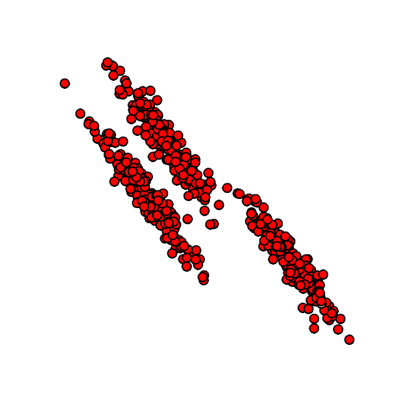

    Filtrations of simplicial complexes, and their representations, encode topological information about a set of points, or a network graph. The 0’th dimensional persistent homology includes only points and edges, forming connected components, i.e. clusters. The bottleneck and wasserstein distances on persistence diagrams have been proven to be stable, which gives a theoretical support to using these tools in noisy real-world scenarios. Vectorizations like persistence landscapes and persistent entropy can be used as inputs to machine learning models, extending usefuleness even further. These representations are a powerful tool for feature detection in predictive models. Bi-filtrations extend these capabilites by introducing a second parameter to the filtration, such as a function accounting for density, or another known property of the data. Work from Bubenik and others has shown the fundamental ability of persistence diagrams to separate noise from truly persistent topological features, and a basic connection between persistence diagrams and statistics, with the possibility of applying hypothesis testing to a set of barcodes. All of this taken together implies that persistence diagrams contain inherently agnostic, yet rich statistical information about the clustering (and higher dimensional) behavior of datasets across scales and dimensions, similar to the structure of hierarchical clustering, but including additional topological information. Here, we propose a parameter agnostic clustering algorithm, based on the statistical partitioning of persistence diagrams into noise and features, called Proportional Gap Ordering, It transforms a filtration of simplicial complexes into a probability vector, and chooses optimal cutoffs within the filtration based on the behavior of connected components, producing cluster assignments for a data set, along with a measure of likeliness for each possible clustering.

#References:

'''
Blumberg, Andrew J., and Michael, Lesnick. "Stability of 2-Parameter Persistent Homology." (2020). 

Cohen-Steiner, David, Herbert Edelsbrunner and John Harer. “Stability of Persistence Diagrams.” Discrete & Computational Geometry 37 (2007): 103-120.
'''

Cohen-Steiner, David, Herbert Edelsbrunner and John Harer. “Stability of Persistence Diagrams.” Discrete & Computational Geometry 37 (2007): 103-120.