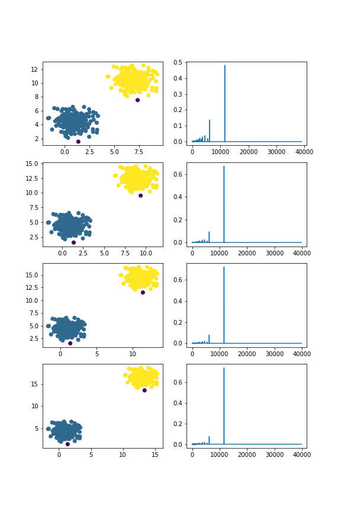
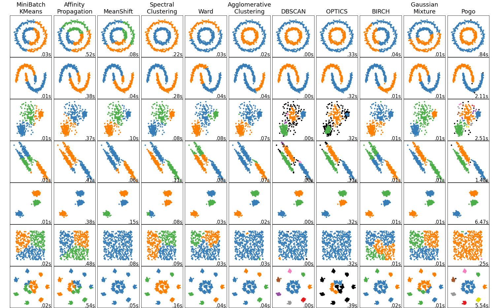

# Proportional Gap Ordering (PoGo): Parameter Agnostic Topological Clustering in Metric Spaces


Figure 1. An animation of how Pogo proceeds through a dataset using persistent homology. The clusters merge and stabilize into their most prominent arrangement. The goal of Pogo is to find the best cutoff within the sequence, and assign a confidence.<br><br>
    
    
## Abstract

Proportional Gap Ordering (Pogo) is a parameter agnostic clustering algorithm, which assigns cluster labels to a dataset by choosing a cutoff from a nested sequence of clusterings. Pogo transforms a filtration of simplicial complexes into a probability vector, and orders potential cutoffs based on the behavior of connected components, producing cluster assignments along with a measure of likeliness for each possible clustering. In contrast to most clustering algorithms, Pogo takes no parameters at all, meaning that no a priori knowledge of the dataset structure is required to obtain reasonable clustering labels.

## Introduction
Filtrations of simplicial complexes, and representations like barcodes [Ghrist 2008] and persistence diagrams [Edelsbrunner 2000], encode topological information about a set of points, or a network graph. The 0’th dimensional persistent homology includes only points and edges, forming connected components, i.e. clusters. Finding a cutoff within a filtration is then equivalent to choosing a clustering assignment [Myers 2020]. The bottleneck and wasserstein distances on persistence diagrams have been proven to be stable [Cohen-Steiner 2007], which gives a theoretical support to using the tools of persistent homology in noisy real-world scenarios. Vectorizations like persistence landscapes [Bubenik 2015] and persistent entropy [Atienza 2017] can be used as inputs to machine learning models, extending usefuleness even further. These representations are a powerful tool for feature detection in predictive models. Bi-filtrations [Blumberg 2020, Vipond 2020, Vipond 2021] multiply these capabilites by introducing a second parameter to the filtration, such as a function accounting for density, or another known property of the data. This addresses the primary weakness of single parameter persistent homology, which is unable to account for regions of density. Other work has shown the fundamental ability of persistence diagrams to separate noise from topological features [Bubenik 2020, Wang 2010], due to the stable statistical properties of barcodes and filtrations [Mileyko 2011, Fasy 2014]. All of this taken together implies that filtrations contain inherently agnostic, yet rich statistical information about the clustering (and topological) behavior of datasets across scales and dimensions [Güzel 2022, Chowdhury 2017]. Other attempts have been made, with various approaches, to use topology, and especially persistent homology, as a basis for clustering algorithms [Songdechakraiwut 2021, Davies 2020, Islambekov 2018, Kindelan 2021].
  

## Background Concepts
Pogo makes use of several basic mathematical concepts and constructions from various fields. The primary tool is persistent homology, a data analysis framework from topology which characterizes data by building a filtration, or nested sequence, of simplicial complexes, i.e. points and their connections. "The use of persistence [...] provides a sound theoretical framework for characterizing the correct number of clusters, in the same spirit as spectral clustering." [Chazal 2013] The correctness of a clustering is an interesting question, and suggests a path to combining statistics with clustering. Probability vectors are used to simplify the statistical interpretation of filtrations, by renormalizing to a sensible range that outputs percentages. The silhouette score [Rousseeuw 1987] is used as an optimization aid, because it very profoundly connects probability and clustering. Pogo combines these tools to introduce a new transformation of filtrations, and an associated process, that can allow for optimizing cutoffs, the 'inverted scaled gap probability vector' or 'gap vector'. An iterative process of optimization, similar in effect to an elbow method for silhouette scores, is used to adjust the final cutoff location.

## Procedure
Pogo begins by building a filtration of simplicial complexes from a dataset, either a point cloud, or a distance matrix, which can represent a network graph. The software package 'Gudhi' is used for this step, resulting in a data structure known as a simplex tree [Boissonnat 2014]. Pogo then calculates the differences between the distance value of each consecutive birth/death pair, and scales them by their position within the filtration, giving the algorithm it's name, Proportional Gap Ordering. This scaling weights the location of the cutoff towards the beginning of the filtration. The 'scaled gaps' are then transformed into a probability vector, which we call a 'gap vector,' harnessing the power of statistics to give intelligible information about cluster likelihoods. The algorithm then merges the dataset hierarchically, based on the assignment of clusters in 0'th-dimensional persistent homology, returning a cleaner probability vector. This is accomplished by assigning any values in the 'gap vector' to the earliest occurence of each clustering, or arrangement of connected components, thus ignoring any instracluster connections. The result is essentially a filtration of unique clusterings. This situation is described colloquially in [Chazal 2013]: "The hierarchy of clusterings induced by persistence provides a coarse-to-fine representation of the input point cloud, which may help the user find the best scale(s) at which to process the data." Pogo then takes the index of the maximum value as the cutoff within the filtration, and the simplicial complex located at that cutoff is considered to be the most prominent clustering.  In most cases, this will represent a defensible clustering arrangement that satisfies common sense. 


Figure 2. As two clusters are separated by more and more distance, the largest value of the 'proportional gap probability vector' gets larger and larger, indicating greater confidence in the cluster assignment.<br><br>


At the last step, an additional process of optimization is performed which has the potential to change the location of the cutoff. If the dataset has overlapping clusters, or is especially noisy, optimizing for the maximum silhouette score of other candidate indices while only allowing the cutoff to move backwards through the filtration allows for the discovery of fine-grained sub-clustering behavior, which is usually what people want to know about a dataset, in addition to it's more global properties. The silhouette score is able to acheive this because it captures very effectively the essense of what clustering actually is: a ratio of intracluster distances to intercluster distances. This raises another interesting approach, using data sets with particular properties, like self-similarity [Schweinhart 2020], to assess clustering algorithms. Sparse, symmetric, self-similar test sets push the capabilities of clustering algorithms to their limits, and can expose design flaws or strengths by providing edge cases that are also easily interpretable by human beings.

## Pseudocode

Input: S, a Simplex Tree, of maximum dimension 1. 
S is a list of tuples, each of which takes the form: ((v1,v2): a pair of vertices, d: distance value in the filtration where this feature is 'born.')  
Instantiate an array A, of all zeroes (or all negative ones) with shape: (length of simplex tree, length of M).  
Instantiate a counter C <- 0.  
Instantiate an empty list_of_distances <- []  

for tuple i in S:  
&nbsp;&nbsp;list_of_distances.append(d)  
&nbsp;&nbsp;while any(A[i]) < 1: //points have not merged to one cluster yet  
&nbsp;&nbsp;&nbsp;&nbsp;//if both points are still in cluster 0, assign both to a new cluster  
&nbsp;&nbsp;&nbsp;&nbsp;if A[i,v1] and A[i,v2] < 1:  
&nbsp;&nbsp;&nbsp;&nbsp;&nbsp;&nbsp;assign A[i,v1] and A[i,v2] <- C.  
&nbsp;&nbsp;&nbsp;&nbsp;&nbsp;&nbsp;increment C.  
&nbsp;&nbsp;&nbsp;&nbsp;//if one point is in cluster 0 and one is not, assign the one in cluster 0 to the existing cluster  
&nbsp;&nbsp;&nbsp;&nbsp;elif A[i,v1] > 0 and A[i,v2] < 1:  
&nbsp;&nbsp;&nbsp;&nbsp;&nbsp;&nbsp; A[i,v2] <-  A[i,v1]  
&nbsp;&nbsp;&nbsp;&nbsp;elif A[i,v2] > 0 and A[i,v1] < 1:  
&nbsp;&nbsp;&nbsp;&nbsp;&nbsp;&nbsp;A[i,v1] <-  A[i,v2]  
&nbsp;&nbsp;&nbsp;&nbsp;//if both points are not in cluster 0 and not in the same cluster, merge clusters to the lower number cluster  
&nbsp;&nbsp;&nbsp;&nbsp;elif A[i,v1] and A[i,v2] > 0, and  A[i,v1] != A[i,v2]:  
&nbsp;&nbsp;&nbsp;&nbsp;&nbsp;&nbsp;larger_cluster_label <- max(v1,v2)  
&nbsp;&nbsp;&nbsp;&nbsp;&nbsp;&nbsp;smaller_cluster_label <- min(v1,v2)  
&nbsp;&nbsp;&nbsp;&nbsp;&nbsp;&nbsp;idx = A[i,:] where A[i,:] == larger_cluster_label  
&nbsp;&nbsp;&nbsp;&nbsp;&nbsp;&nbsp;A[i, idx] <- smaller_cluster_number  

gaps_ <- list_of_distances.diff() // takes the difference of each successive distance value.  
normed_distance <- gaps.MinMaxScaler // normalizes gaps to a range of (0,1).  
inverted_normed_distance <- 1 -  normed_distance // a discrete function with negative slope and curvature in (0,1).  
raised_inverted_normed_distance <- inverted_normed_distance^4  
//raising to a power increases early weighting. Tunable Parameter.  
normed_gaps <- multiply(gaps, raised_inverted_normed_distance) //crucial step, scales gaps proportionately.  
gap_vector <- normed_gaps / np.sum(normed_gaps) //normalizes so the sum of the vector is 1, i.e. a probability vector.  


//collapse values in the gap vector to the earliest instance of each unique clustering  
marker <- 0  
for i in range(1,length(S)-1):  
&nbsp;&nbsp;if A[marker] == A[i]:  
&nbsp;&nbsp;&nbsp;&nbsp;gap_vector[marker] += gap_vector[i]  
&nbsp;&nbsp;&nbsp;&nbsp;gap_vector[i] = 0  
&nbsp;&nbsp;else:  
&nbsp;&nbsp;&nbsp;&nbsp;marker = i  


//assign the index of the largest value to be the cutoff  
candidates <- flip(argsort(gap_vector))  
cutoff <- candidates[0]  

//look for a better cutoff earlier in the filtration  
for element in candidates[1:]:  
&nbsp;&nbsp;while index(element) < index(cutoff) and \\  
&nbsp;&nbsp;silhouette_score(element) > silhouette_score(cutoff):  
&nbsp;&nbsp;&nbsp;&nbsp;cutoff <- element


## Test Sets
These are the exact test sets used in the scikitlearn tutorial on clustering. The only change is that the results of Pogo have
been added as the column on the right side, and another clustering test set has been added at the bottom [Fanti 2018]. Pogo performs comparably well to the other algorithms, exhbiting behavior expected of a topological algorithm, i.e. discerning shapes with intertwining features. The algorithm is also capable of outputting outliers, which are shown as black data points. It's currently not optimized for speed, as it's still in an experimental phase, but several easy improvements for speed and reducing algorithmic complexity are in the works.

Figure 3. An automated run of clustering test sets from scikit-learn. Pogo results are the far right column.<br><br>

## Conclusion and Next Steps
Several Additional improvements are already underway. A process to combine different partitions of cutoffs from different locations might allow a workaround to the insensitivity to density. If the filtration can be 'frozen' at some point, and then have the remaining outliers 'polled' for which cluster they would be in, then the regions of overlap between clusters might be more accurately assigned, giving a slight preference for areas on the edges of clusters to remain in the largest clusters, which would improve the results dramatically. In work from Frederic Chazal's group, they describe procedures that produce cluster assignments with stable statistical properties that extend to individual points:
```
This opens up the possibility of doing soft-clustering, where each
point is assigned to a cluster with some probability. Finally we note that, because
we use a topological framework, additional features can be extracted from the data
through higher-dimensional persistence diagrams [Chazal et al. 2011], such as the cir-
cular structure [...] although it is not yet clear how this type of information can be exploited. [Chazal 2013]
```
Individual data points might be seen as having an individual filtration of the clusters that they belong to, over time. If individual points can be characterized as having a statistical relationship with this or that cluster, then the entire filtration should also have those characteristics. A clustering arrangement composed of points polled individually as to which cluster they belong to with the highest statistical certainty would contain a mixture of information from different regions of the filtration, and hopefully combine them into a sensible clustering output.
Further improving the statistical ouputs of pogo is a priority. Often, pogo seems to give an overly high confidence for the initial cutoff. While human intution is always looking for more detail, the algorithm seems to be balanced primarily with the global properties of the dataset. Finally, if we suppose that a similar cutoff optimization algorithm could be run on a bi-filtration, would the balance then shift towards local structure? Intuitively, finding such a cutoff within a bi-filtration could give higher test accuracies, because of it's ability to find a balance between local and global stucture in a dataset.

## References

[Atienza 2017] Atienza, Nieves, Rocío González-Díaz and Matteo Rucco. “Persistent entropy for separating topological features from noise in vietoris-rips complexes.” Journal of Intelligent Information Systems 52 (2017): 637-655.

[Blumberg 2020] Blumberg, Andrew J., and Michael Lesnick. "Stability of 2-Parameter Persistent Homology." (2020). 

[Boissonnat 2014] Boissonnat, Jean-Daniel and Clément Maria. “The Simplex Tree: An Efficient Data Structure for General Simplicial Complexes.” Algorithmica 70 (2014): 406-427.

[Bubenik 2015] Bubenik, Peter. “Statistical topological data analysis using persistence landscapes.” J. Mach. Learn. Res. 16 (2015): 77-102.

[Bubenik 2020] Bubenik, Peter, Michael Hull, Dhruv Patel and Benjamin Whittle. “Persistent homology detects curvature.” Inverse Problems 36 (2020).

[Chazal 2013] Chazal, Frédéric, Leonidas J. Guibas, Steve Oudot and Primoz Skraba. “Persistence-Based Clustering in Riemannian Manifolds.” J. ACM 60 (2013): 41:1-41:38.

[Chowdhury 2017] Chowdhury, Samir and Facundo Mémoli. “Convergence of Hierarchical Clustering and Persistent Homology Methods on Directed Networks.” ArXiv abs/1711.04211 (2017).

[Cohen-Steiner 2007] Cohen-Steiner, David, Herbert Edelsbrunner and John Harer. “Stability of Persistence Diagrams.” Discrete & Computational Geometry 37 (2007): 103-120.

[Davies 2020] Davies, Thomas O. M., Jack Aspinall, Bryan Wilder and Long Tran-Thanh. “Fuzzy c-Means Clustering for Persistence Diagrams.” ArXiv abs/2006.02796 (2020).

[Edelsbrunner 2000] Edelsbrunner, Herbert, David Letscher and Afra Zomorodian. “Topological Persistence and Simplification.” Discrete & Computational Geometry 28 (2000): 511-533.

[Fanti 2018] P. Fänti and S. Sieranoja. "K-means properties on six clustering benchmark datasets." Applied Intelligence, 48 (12), 4743-4759, December (2018), https://doi.org/10.1007/s10489-018-1238-7.

[Fasy 2014] Fasy, Brittany Terese, Fabrizio Lecci, Alessandro Rinaldo, Larry A. Wasserman, Sivaraman Balakrishnan and Aarti Singh. “Confidence sets for persistence diagrams.” The Annals of Statistics 42 (2014).

[Ghrist 2008] Ghrist, Robert. "Barcodes: The persistent topology of data." Bulletin of the American Mathematical
Society (2008), 45(1):61–75.

[Güzel 2022] Güzel, Ismail and Atabey Kaygun. “A new non-archimedean metric on persistent homology.” Comput. Stat. 37 (2022): 1963-1983.

[Islambekov 2018] Islambekov, Umar and Yulia R. Gel. “Unsupervised space–time clustering using persistent homology.” Environmetrics 30 (2018).

[Kindelan 2021] Kindelan, Rolando, Jos'e Fr'ias, Mauricio Cerda and Nancy Hitschfeld-Kahler. “A Topological Data Analysis Based Classifier.” ArXiv abs/2111.05214 (2021).

[Mileyko 2011] Mileyko, Yuriy, Sayan Mukherjee and John Harer. “Probability measures on the space of persistence diagrams.” Inverse Problems 27 (2011): 124007.

[Myers 2020] Myers, Audun D., Firas A. Khasawneh and Brittany Terese Fasy. “Separating Persistent Homology of Noise from Time Series Data Using Topological Signal Processing.” arXiv: Algebraic Topology (2020).

[Rousseeuw 1987] Rousseeuw, Peter J.. “Silhouettes: a graphical aid to the interpretation and validation of cluster analysis.” Journal of Computational and Applied Mathematics 20 (1987): 53-65.

[Schweinhart 2020] Schweinhart, Benjamin. “Fractal dimension and the persistent homology of random geometric complexes.” Advances in Mathematics (2020).

[Songdechakraiwut 2021] Songdechakraiwut, Tananun, Bryan M. Krause, Matthew I. Banks, Kirill V. Nourski and Barry D. Van Veen. “Fast Topological Clustering with Wasserstein Distance.” ArXiv abs/2112.00101 (2021).

[Vipond 2020] Vipond, Oliver. “Multiparameter Persistence Landscapes.” J. Mach. Learn. Res. 21 (2020): 61:1-61:38.

[Vipond 2021] Vipond, Oliver, Joshua A. Bull, Philip S. Macklin, Ulrike Tillmann, Christopher W. Pugh, Helen M. Byrne and Heather A. Harrington. “Multiparameter persistent homology landscapes identify immune cell spatial patterns in tumors.” Proceedings of the National Academy of Sciences of the United States of America 118 (2021).

[Wang 2010] Wang, Bei. "Separating Features from Noise with Persistence and Statistics." Department of Computer Science, Duke University, Ph.D. Dissertation, 2010.

## Additional Reading


Adler, Robert J., Omer Bobrowski and Shmuel Weinberger. “Crackle: The Persistent Homology of Noise.” arXiv: Probability (2013).

Masoomy, H., Behrouz Askari, M N Najafi and S. M. S. Movahed. “Persistent homology of fractional Gaussian noise.” Physical review. E 104 3-1 (2021): 034116.

Myers, Audun D., Firas A. Khasawneh and Brittany Terese Fasy. “ANAPT: Additive noise analysis for persistence thresholding.” Foundations of Data Science (2022).


